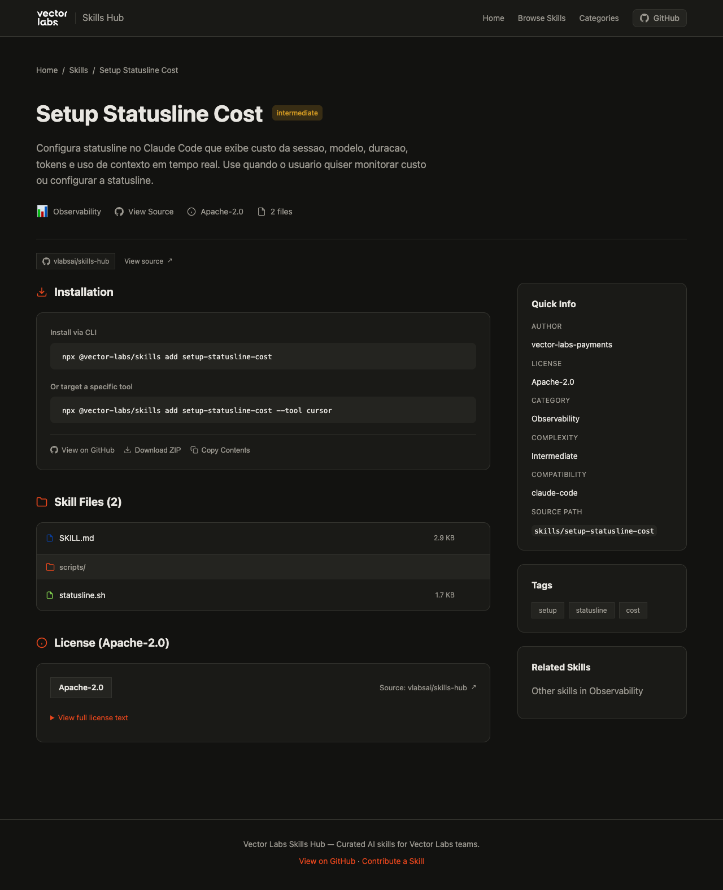

# Vector Labs Skills Hub

Catálogo de skills que ensinam assistentes de IA (Claude Code, Cursor, Copilot, Gemini) a executar tarefas do dia a dia da Vector Labs.




## O que é uma Skill

Uma skill é um diretório com um arquivo `SKILL.md` — frontmatter YAML com metadados + instruções em Markdown que o assistente de IA segue. Pode incluir scripts e arquivos auxiliares.

```
skills/setup-statusline-cost/
├── SKILL.md         # Frontmatter + instruções
└── scripts/         # Arquivos auxiliares (opcional)
```

## Curadoria

Toda skill neste catálogo passa por review humano via Pull Request antes de ser publicada. O autor é sempre identificado no frontmatter (`metadata.author`). O código-fonte é aberto e auditável neste repositório.

## Usar uma skill

```bash
npx @vector-labs/skills add setup-statusline-cost
```

O CLI detecta automaticamente a ferramenta (`.claude/`, `.cursor/`, `.github/copilot-*`, `.gemini/`) e copia os arquivos para o diretório correto. Use `--tool <id>` para escolher manualmente.

```bash
npx @vector-labs/skills list              # listar skills disponíveis
npx @vector-labs/skills info <name>       # ver detalhes de uma skill
```

## Criar uma skill

Crie um diretório em `skills/` com um `SKILL.md`:

```yaml
---
name: minha-skill
description: O que a skill faz e quando usar.
license: Apache-2.0
metadata:
  author: seu-time
  version: "1.0"
---

# Título

Instruções que o assistente vai seguir.
```

Veja [CONTRIBUTING.md](CONTRIBUTING.md) para detalhes sobre frontmatter, convenções e processo de review.

## Desenvolvimento local

```bash
npm install
npm run dev          # aggregate skills + astro dev (porta 4321)
```

```bash
npm run build        # aggregate + astro build
npm run aggregate    # só regenerar skills.json
node cli/bin/vector-labs-skills.js list --source .   # testar CLI com skills locais
```

## Estrutura do projeto

```
skill-hub/
├── skills/                    # Skills (cada uma é um diretório com SKILL.md)
├── site/                      # Site Astro (catálogo web)
│   └── src/data/skills.json   # Gerado por aggregate-skills.js
├── cli/
│   ├── bin/vector-labs-skills.js     # CLI entry point
│   └── package.json           # @vector-labs/skills (publicável no GitHub Packages)
├── scripts/
│   └── aggregate-skills.js    # Lê skills/ → gera skills.json
└── .github/workflows/
    └── deploy.yml             # Build + deploy GitHub Pages (push to main)
```

## License

MIT — see [LICENSE](LICENSE).
